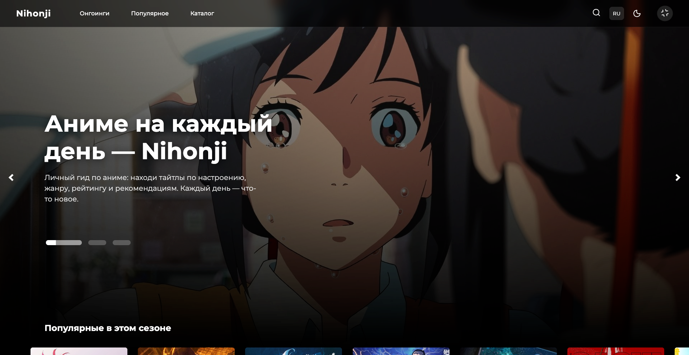
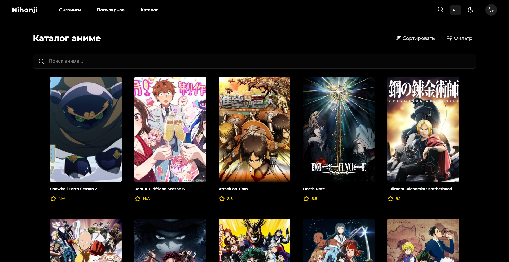
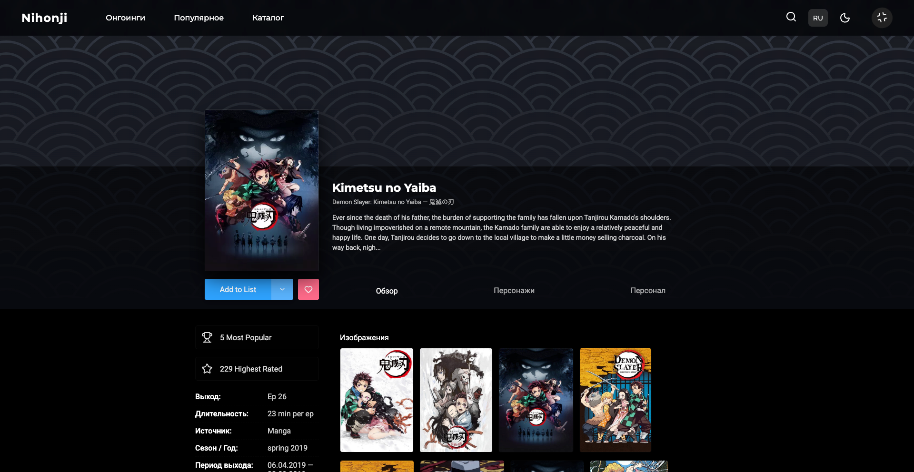

# Nihonji

**Nihonji** — это веб-приложение для поиска и просмотра аниме.

Проект сделан на **React + TypeScript** и использует открытое API **[Jikan](https://jikan.moe/)**.
В приложении можно смотреть популярные тайтлы, искать аниме, открывать подробную информацию и сохранять интересные тайтлы в избранное.

---

## Скриншоты

### Главная страница

На главной странице отображаются популярные аниме и основные разделы приложения.



### Каталог / поиск

В каталоге можно искать аниме по названию, фильтровать, сортировать список и открывать нужный тайтл.



### Страница аниме

На странице тайтла показана подробная информация: описание, рейтинг, трейлер, студии, персонажи и рекомендации.



---

## Что умеет приложение

### Просмотр аниме

В приложении можно:

* смотреть список популярных аниме;
* искать аниме по названию;
* открывать страницу конкретного тайтла;
* смотреть описание, рейтинг, трейлер, студии и другую информацию;
* получать рекомендации и похожие тайтлы.

### Пользовательские функции

Также реализованы:

* добавление аниме в избранное;
* история просмотренных тайтлов;
* лайки;
* сохранение данных в `localStorage`;
* восстановление позиции скролла при возврате назад.

### Интерфейс

В интерфейсе есть:

* светлая и тёмная тема;
* адаптивная вёрстка для разных экранов;
* анимации;
* skeleton-загрузки;
* обработка ошибок;
* пагинация и бесконечная подгрузка.

---

## Архитектура проекта

Проект построен по подходу **Feature-Sliced Design**.

Структура выглядит так:

```text
src/
  app/          настройки приложения, роутинг, провайдеры
  pages/        страницы
  widgets/      крупные блоки интерфейса
  features/     пользовательские действия
  entities/     основные сущности: Anime, Character, Studio
  shared/       общие компоненты, API, утилиты и типы
```

Такой подход помогает держать проект понятным:
страницы лежат отдельно, бизнес-логика отдельно, общие компоненты отдельно.

---

## Технологии

В проекте используются современные инструменты для frontend-разработки:

### Frontend

<p>
  
  
  
  
</p>

### Состояние и работа с API

<p>
  
  
  
</p>

### Стили и интерфейс

<p>
  
  
  
</p>

### Качество кода

<p>
  
  
  
</p>

### Тестирование

<p>
  
  
</p>

### Дополнительно

<p>
  
  
</p>

---

## API

Для получения данных используется открытое API **Jikan**.

Через API загружаются:

* списки аниме;
* подробная информация о тайтлах;
* персонажи;
* студии;
* рекомендации;
* трейлеры.

Запросы реализованы через **RTK Query**, поэтому данные кешируются и не загружаются лишний раз.

---

## Как запустить проект

Сначала установите зависимости:

```bash
npm install
```

Запуск проекта в режиме разработки:

```bash
npm run dev
```

Сборка проекта:

```bash
npm run build
```

Проверка кода:

```bash
npm run lint
```

Запуск тестов:

```bash
npm run test
```

---

## Что было важно в разработке

При разработке я уделял внимание:

* понятной структуре проекта по Feature-Sliced Design;
* переиспользуемым UI-компонентам;
* удобной работе с API через RTK Query;
* обработке состояний загрузки, ошибок и пустых данных;
* адаптивной вёрстке;
* сохранению пользовательских данных в localStorage;
* чистому и поддерживаемому коду.
